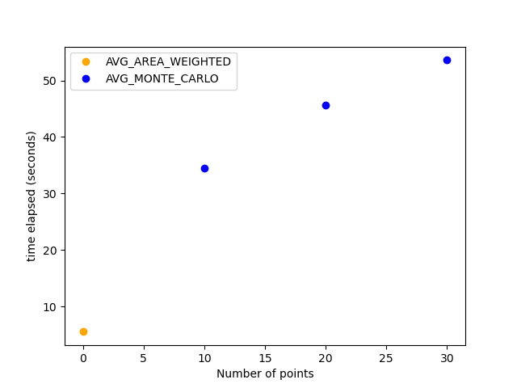

# Geographical data aggregation
## Goal
> Some observational data is represented as a set of shapes with a value assigned to each shape. An example are clouds of smoke caused by wildfires. These clouds are registered by satellites and each cloud is assigned a value for density of the smoke. Additionally, other data can be included, such as the time period for the observation, i.e. time period when the cloud was visible. We will call this set of shapes observational set, or observational shapefile.  
> For data processing pipelines it is often required to aggregate this data by geographic regions, that are also represented as a set of shapes. Geographic region shapefile can be contain counties, postal codes, countries, states, etc. We will call this set geographic set of geographic shapefile.  
> The idea is to look what observational data from the observational shapefile exists for each given region for a given period of time and calculate aggregate value for each region and time period. For example calculate aggregated value of smoke density for each postal code area.  
> <cite>[Michael Bouzinier]</cite>

## Types of aggregation
Two different aggregation functions are implemented: maximum and average. 
To use maximum aggregation you should provide --agg-type MAX parameter to script.
Average function is implemented in two different options --agg-type MONTE_CARLO and --agg-type AVG_AREA_WEIGHTED.

Also, there is an additional option --time-agg of aggregation over time (by year, by month or by day).  
Here is an explanation how the aggregation works with and without time option.
### MAX
If no time aggregation type is specified maximum value of obs-id column from obs-shp is returned for every area in geo-shp file.  
If time aggregation type is specified then every observation in obs-shp file is preliminarily annotated with period of data 
during which this event occurred. And then for every area in geo-shp file and every period of time observed maximum value 
of obs-id column from obs-shp is returned. 
### Average
#### AVG_AREA_WEIGHTED
If no time aggregation type is specified for every area in geo-shp file value of obs-id column from obs-shp file 
averaged by area that event occupied is returned (without weighting by fraction of time period occupation).  
If time aggregation type is specified then every observation in obs-shp file is preliminarily annotated with period of data 
during which this event occurred, and resulting value for every area in geo-shp is additionally weighted by 
fraction of time period during which the event occurred. 
#### AVG_MONTE_CARLO
> **_WARNING:_** [look at AVG_AREA_WEIGHTED VS MONTE_CARLO speed](./README.md#avg_area_weighted-vs-monte_carlo-speed)

To speed up averaging this additional type of aggregation was implemented, and it is so, that the area 
of the event is estimated by counting the fraction of randomly chosen points that get into every area of interest.  
There are several possibilities to deal with the error of approximation:
1) if the max-error parameter is provided, the points will be sampled until the necessary relative error will be achieved, but it can took a lot of time to reach the result
2) if the number of points is specified, just that number of points will be randomly sampled and the error will be estimated 
In both cases the column with estimated std will be provided with the result.
The same things about time aggregation as for AVG_AREA_WEIGHTED method are relevant 
(so the time aggregation is implemented not via Monte-Carlo approximation but just via weighting)

## Script usage
```
usage: aggregator.py [-h] [--geo-shp GEO_SHP] [--geo-id GEO_ID]
                     [--geo-add GEO_ADD [GEO_ADD ...]] [--obs-shp OBS_SHP]
                     [--obs-ids OBS_IDS [OBS_IDS ...]]
                     [--agg-type {MAX,AVG_AREA_WEIGHTED,AVG_MONTE_CARLO}]
                     [--epsg EPSG] [--n N] [--max-error MAX_ERROR]
                     [--time-agg {DAILY,MONTHLY,ANNUAL}]
                     [--time-start-id TIME_START_ID]
                     [--time-end-id TIME_END_ID]
                     [--time-id-format TIME_ID_FORMAT] [--out-csv OUT_CSV]
                     [--log-level {CRITICAL,FATAL,ERROR,WARN,WARNING,INFO,DEBUG,NOTSET}]

Spatial data aggregation. Attention! In this code some technical columns are
added to datasets with names starting from "aggregator_". Do not use such
column names in input files to avoid interference!

options:
  -h, --help            show this help message and exit

Geographical shape file:
  --geo-shp GEO_SHP     Path to geographical .shp file (default: None)
  --geo-id GEO_ID       The name of the identifier column of the geographic
                        region (default: None)
  --geo-add GEO_ADD [GEO_ADD ...]
                        A set of additional columns (fields, annotations) from
                        geographic shapes to include in the result (default:
                        None)

Observational shape file:
  --obs-shp OBS_SHP     Path to observational .shp file (default: None)
  --obs-ids OBS_IDS [OBS_IDS ...]
                        The name(s) of the value column for observational
                        shapes (default: None)

Aggregation parameters:
  --agg-type {MAX,AVG_AREA_WEIGHTED,AVG_MONTE_CARLO}
                        Aggregation type (default: None)
  --epsg EPSG           Which EPSG to use when counting area (default: 5070)
  --n N                 Number of subsamples for error estimation of MC
                        approximation (default: 500)
  --max-error MAX_ERROR
                        Max estimated relative error of MC approximation
                        (default: None)

Time aggregation parameters:
  --time-agg {DAILY,MONTHLY,ANNUAL}
                        Time aggregation type if required (default: None)
  --time-start-id TIME_START_ID
                        The name of the datetime column of observation start
                        (for time aggregation) (default: Start)
  --time-end-id TIME_END_ID
                        The name of the datetime column of observation end
                        (for time aggregation) (default: End)
  --time-id-format TIME_ID_FORMAT
                        The datetime format string of columns 'time-start-id'
                        and 'time-end-id' (to parse with datetime.strptime)
                        (default: %Y%j %H%M)

Output options:
  --out-csv OUT_CSV     Path to output aggregated data .csv (default: None)

Logging options:
  --log-level {CRITICAL,FATAL,ERROR,WARN,WARNING,INFO,DEBUG,NOTSET}
                        Logging level (default: INFO)
```
## Script launching example
```
python aggregator.py
    --obs-shp data_examples/observation_shape_sample/shapefile_21_22.sub.shp
    --geo-shp data_examples/geography_shape/cb_2018_us_county_500k/cb_2018_us_county_500k.shp
    --geo-id COUNTYNS
    --geo-add NAME
    --agg-type AVG_AREA_WEIGHTED
    --time-agg DAILY
    --obs-id Density
    --out-csv hms_smoke20220401_cb_2018_us_county_500k.csv
    --log-level INFO
```
## AVG_AREA_WEIGHTED VS MONTE_CARLO speed
The problem is that the implemented Monte-Carlo averaging method did not speed up the calculation but did just the opposite.
As profiling showed slowdown was mostly because of random points generating function, it is too slow.
You can see on the picture below the example of performance test which was run on subsample from data_examples, 
here the Monte-Carlo averaging is hundreds times slower, and the speed is approximately linearly decreasing 
with the number of points considered:


